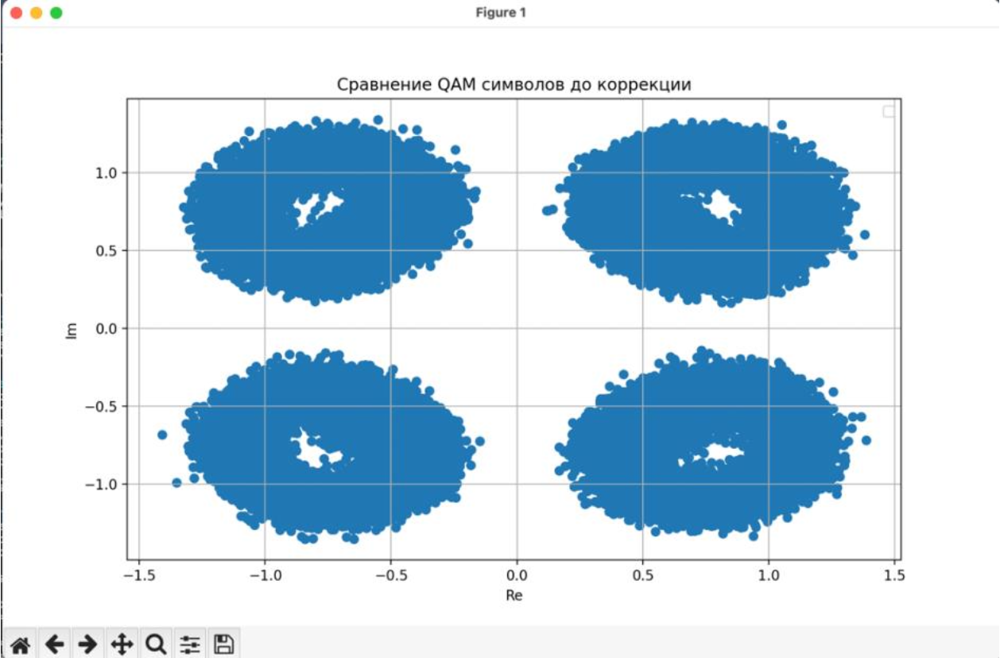
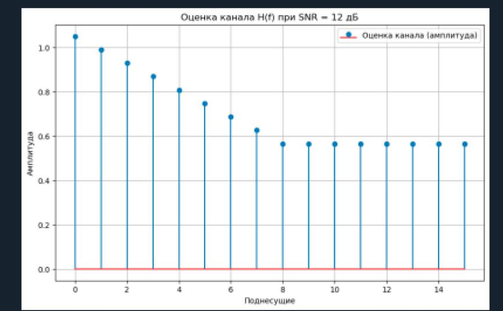
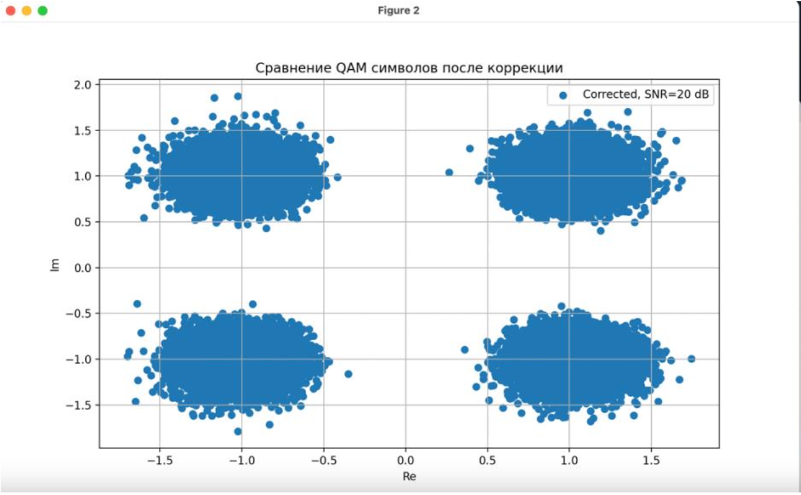
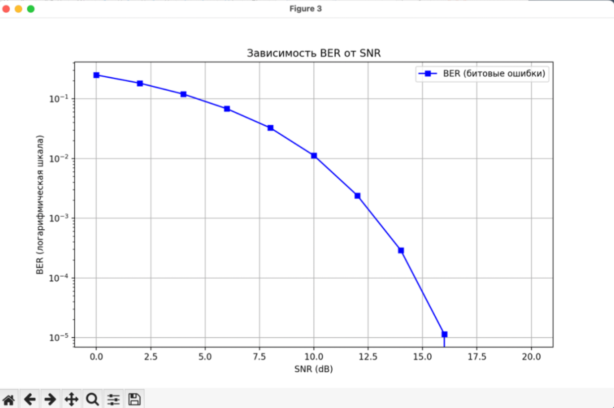
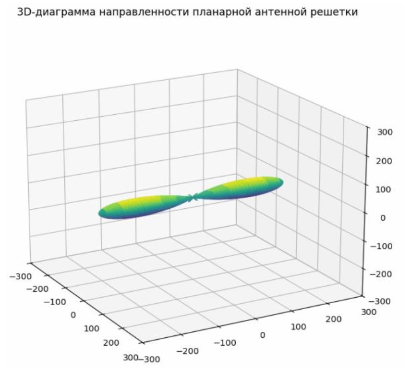
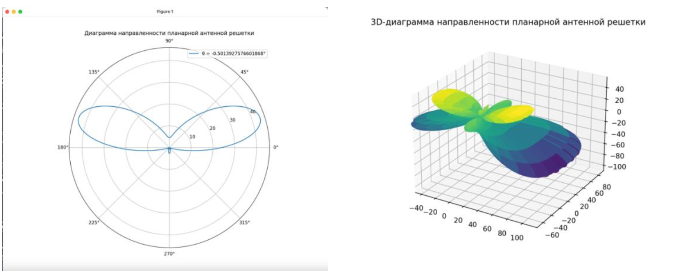
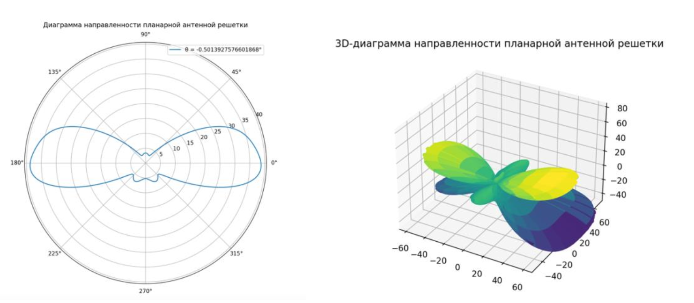
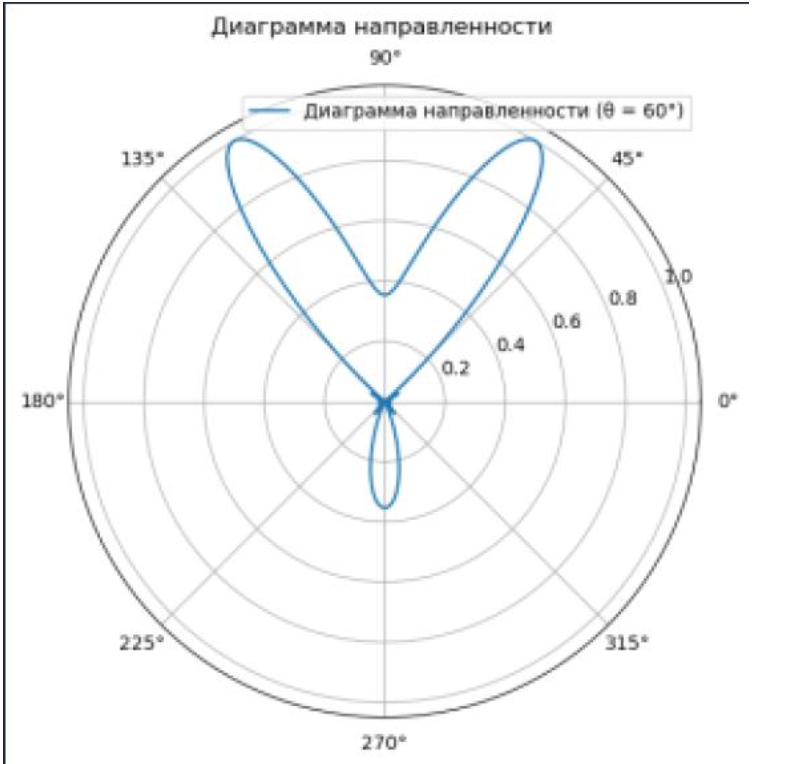

# First Task 
## Oсновы, генерация сигнала в реальном времени

# Second Task 
## Формирование сигналов, визуализация в Python. 

# Third Task
## Изучение основных параметров библиотеки PyAdi для Adalm Pluto SDR
Определение наисильнейшего сигнала - 2412 Мгц
Передача данных на данной частоте

Временные диаграммы 

Количество отсчетов сигнала порядка 200 в команде arrange

# Fourth Task
## Изучение основных свойств ДПФ с помощью моделирования в  Python/Spyder

Для заданных значений частоты сигнала и частоты дискретизации получите дискретное колебание, отсчеты посмотрите в Variable Explorer. Далее увеличьте частоту сигнала в несколько раз, при этом так же увеличится и частота дискретизации, но отношение частоты сигнала и частоты дискретизации - нормированная частота останется той же величиной.
    Сравните дискретные отсчеты первого и второго сигналов.

Измените частоту сигнала в целое чисто раз, определите номер точки
    ДПФ для данного сигнала.

Измените количество точек ДПФ до 512. Вычислите шаг частот между
    точками ДПФ ∆f = fs/N. Определите, в какой точке ДПФ находится заданный сигнал.

# Fifth Task
## Передача/прием sin() сигнала. Реализация АМ модуляции. PlutoSDR.
Передача одиночного сигнала

Передача двоичного кода символа   

# Sixth Task 
## Модуляции QPSK, QAM. Раздельный приём и передача на SDR
Моделирование сигнала, накладывание шума, декодирование

Отправленный и полученный сигнал соответственно

спектр полученного сигнала

# Курсовая работа
## Определение параметров сигнала OFDM и моделирование приема OFDM в радиоканале
Созвездия на поднесущих на выходе канала (до коррекции)

Частотная характеристика канала (АЧХ)

QAM после коррекции

Посчитаем Bit error rate и выведем его

# Расчетно-графическая работа
## изучение алгоритма оценивания канала по методу наименьших квадратов и изучение влияния оценки канала на характеристики прекодирования ZF с помощью моделирования в среде Python

Диаграммы направленности АР с применением весового вектора для выбранных абонентов

Загруженный канал для 1 пользователя

Загруженный канал для 4 пользователя

Диаграмма направленности
